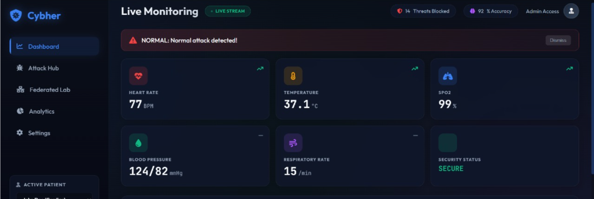
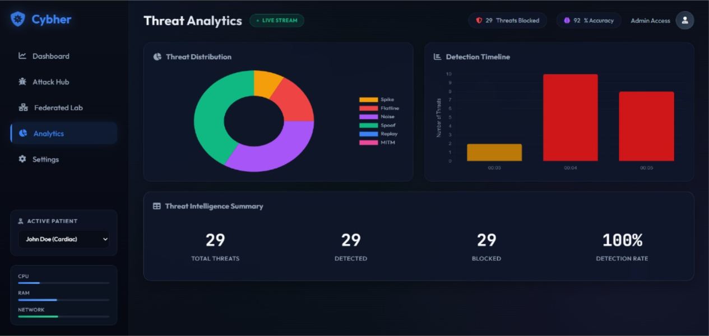
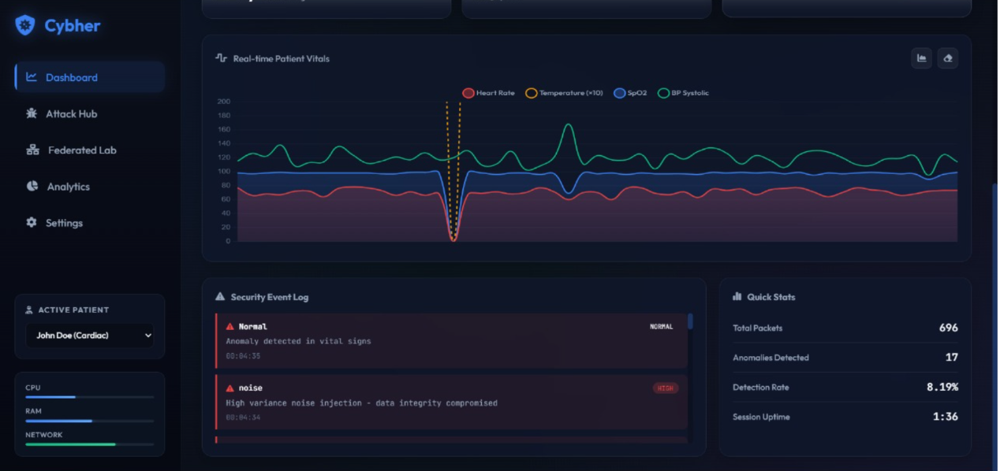
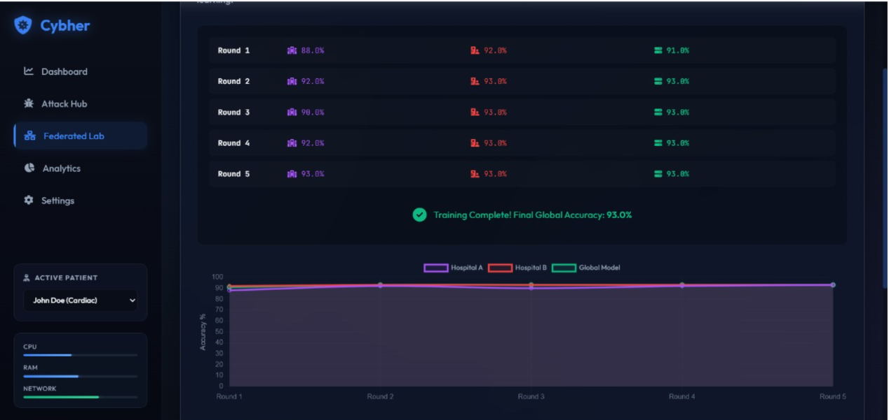
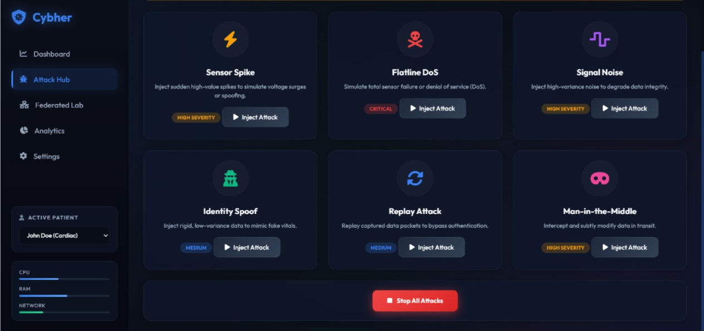

# 📊 Healthcare Data Analytics & Anomaly Detection Dashboard
## 📌 Overview
This project is a real-time healthcare analytics system that monitors patient vitals, detects anomalies, and simulates cyber-attacks using data analytics and machine learning techniques.
## 📊 Dashboard Preview

## 🧠 Key Features
- Real-time patient monitoring (Heart Rate, BP, SpO2, Temperature)
- Interactive dashboard with KPIs
- Data visualization (line chart, bar chart, pie chart)
- Anomaly detection system
- Event log analysis
- Threat detection analytics
## 🤖 Machine Learning
- Federated learning simulation
- Model accuracy tracking (up to 93%)
- Multi-round training system
- Real-time model performance visualization
## 🚨 Attack Simulation
- Sensor spike attack
- Flatline DoS attack
- Signal noise injection
- Identity spoofing
- Replay attack
- Man-in-the-middle attack
## 📈 Insights
- High BP correlates with anomalies
- Detection accuracy reaches up to 93%+
- Real-time trends help identify abnormal patterns
- Threat distribution analysis improves monitoring
## 🛠 Tools & Technologies
- Python (Pandas, NumPy)
- Machine Learning
- Data Visualization
- HTML, CSS, JavaScript
## ▶️ How to Run
pip install -r requirements.txt  
python app/main.py  
## 👩‍💻 Author
G Poorvika Chowdari
